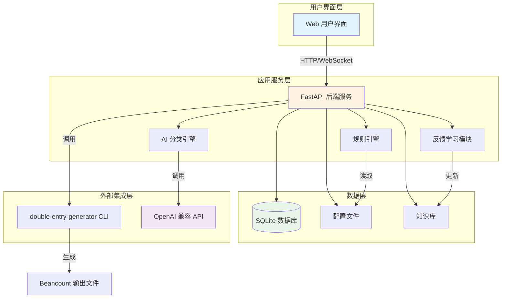
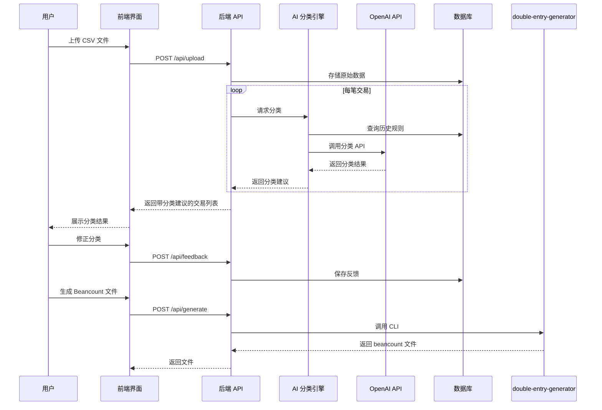
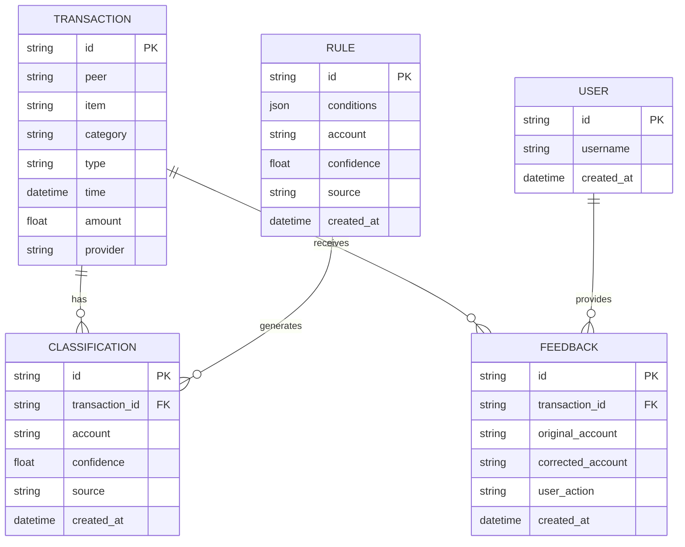
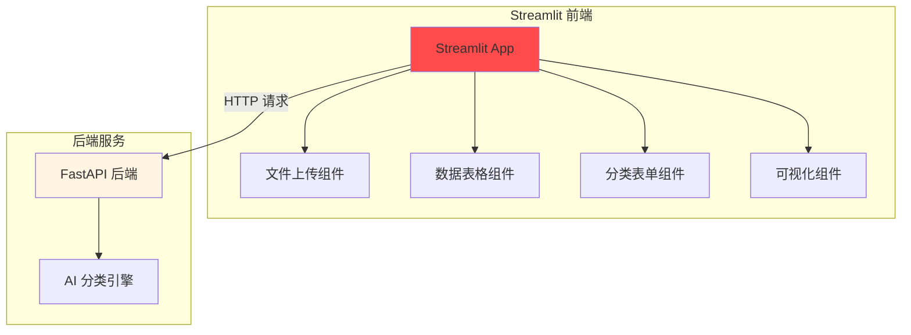

# BeancountPilot 技术架构文档

## 1. 系统概述

BeancountPilot 是一个 AI 增强的智能交易分类和工作流增强工具，专为 Beancount 用户设计。系统通过集成大语言模型（LLM）的语义理解能力，自动化交易分类过程，显著减少用户手动分类的工作量。

### 1.1 核心目标

- **自动化分类**：利用 AI 自动将交易描述分类到正确的 Beancount 账户
- **交互式学习**：通过用户反馈持续优化分类准确性
- **无缝集成**：兼容现有的 `double-entry-generator` CLI 工作流
- **本地优先**：确保敏感财务数据始终在用户控制下

### 1.2 系统约束

- 主要语言：Python
- `double-entry-generator` 作为 CLI 黑盒使用
- AI 接口：兼容 OpenAI 格式的第三方接口，可配置
- 前端：Streamlit（Python 原生，快速开发）

## 2. 系统架构

### 2.1 整体架构图



### 2.2 模块划分

| 模块             | 职责                           | 技术栈                 |
| ---------------- | ------------------------------ | ---------------------- |
| **Web API 服务** | 提供 RESTful API，处理前端请求 | FastAPI                |
| **AI 分类引擎**  | 调用 LLM 进行交易分类          | OpenAI SDK / LangChain |
| **规则引擎**     | 管理和执行基于规则的分类       | Python                 |
| **反馈学习模块** | 收集用户反馈，优化分类         | Python                 |
| **CLI 集成模块** | 调用 double-entry-generator    | subprocess             |
| **数据持久化**   | 存储配置、规则、反馈数据       | SQLite                 |

## 3. 核心模块设计

### 3.1 AI 分类引擎

**职责**：利用 LLM 的语义理解能力，对交易进行智能分类

**工作流程**：

1. 接收交易数据（收款人、商品、类别、时间等）
2. 构建提示词（Prompt），包含用户账户表和历史规则
3. 调用 OpenAI 兼容 API
4. 解析返回结果，提取分类建议和置信度
5. 返回分类结果

**提示词设计示例**：

```python
PROMPT_TEMPLATE = """
你是一个专业的财务会计助手，负责将交易分类到 Beancount 账户表中。

用户账户表：
{chart_of_accounts}

历史分类规则：
{historical_rules}

待分类交易：
- 收款人: {peer}
- 商品: {item}
- 类别: {category}
- 交易类型: {type}
- 时间: {time}

请分析上述交易，从账户表中选择最合适的账户，并给出置信度（0-1）。

输出格式（JSON）：
{{
  "account": "Expenses:Food:Dining",
  "confidence": 0.95,
  "reasoning": "解释分类原因"
}}
"""
```

**配置示例**：

```yaml
ai:
  provider: openai # 或其他兼容 provider
  api_base: https://api.example.com/v1
  api_key: ${AI_API_KEY}
  model: gpt-4o-mini
  temperature: 0.3
  max_tokens: 200
  timeout: 30
```

### 3.2 规则引擎

**职责**：管理基于规则的分类逻辑，作为 AI 分类的补充和兜底

**规则优先级**：

1. 用户明确覆盖规则（最高优先级）
2. AI 分类建议
3. 历史规则匹配
4. 默认账户（最低优先级）

**规则存储格式**：

```json
{
  "rules": [
    {
      "id": "rule_001",
      "name": "美团外卖晚餐",
      "conditions": {
        "peer": ["美团", "饿了么"],
        "time_range": ["16:00", "22:00"]
      },
      "account": "Expenses:Food:Dinner",
      "confidence": 1.0,
      "source": "user",
      "created_at": "2024-01-01T00:00:00Z"
    }
  ]
}
```

### 3.3 反馈学习模块

**职责**：收集用户修正，构建知识库，持续优化分类

**工作流程**：

1. 用户接受 AI 分类 → 记录为正样本
2. 用户修正分类 → 记录为负样本和新规则
3. 定期分析反馈，生成新规则或更新提示词
4. 支持导出规则到 double-entry-generator 配置格式

**数据结构**：

```python
@dataclass
class Feedback:
    id: str
    transaction_id: str
    original_account: str
    corrected_account: str
    user_action: Literal["accept", "reject", "modify"]
    timestamp: datetime
```

### 3.4 CLI 集成模块

**职责**：将 double-entry-generator 作为黑盒 CLI 工具集成

**实现方式**：

```python
import subprocess
from pathlib import Path

def call_double_entry_generator(
    csv_file: Path,
    config_file: Path,
    output_file: Path,
    provider: str = "alipay"
) -> bool:
    """调用 double-entry-generator CLI"""
    cmd = [
        "double-entry-generator",
        "translate",
        "--config", str(config_file),
        "--provider", provider,
        "--output", str(output_file),
        str(csv_file)
    ]
    result = subprocess.run(cmd, capture_output=True, text=True)
    return result.returncode == 0
```

## 4. 数据流设计

### 4.1 主要业务流程



### 4.2 数据实体关系



## 5. 前端技术栈：Streamlit

### 5.1 选择理由

本项目选择 **Streamlit** 作为前端技术栈，主要基于以下考虑：

| 优势             | 说明                                                  |
| ---------------- | ----------------------------------------------------- |
| **Python 原生**  | 无需学习 JavaScript/TypeScript，降低开发门槛          |
| **快速开发**     | 内置文件上传、数据表格、表单等组件，开发效率高        |
| **数据友好**     | 天然支持 pandas、numpy 等数据科学库，适合交易数据展示 |
| **部署简单**     | 单命令启动，无需构建流程                              |
| **适合个人使用** | 目标用户为个人 Beancount 用户，无需复杂的多用户场景   |

### 5.2 Streamlit 应用架构



### 5.3 Streamlit 页面设计

```python
# frontend/app.py

import streamlit as st
from src.api.client import BeancountPilotClient

# 页面配置
st.set_page_config(
    page_title="BeancountPilot",
    page_icon="📊",
    layout="wide"
)

# 侧边栏
with st.sidebar:
    st.title("BeancountPilot")
    st.markdown("---")

    # 配置面板
    st.subheader("AI 配置")
    provider = st.selectbox(
        "AI Provider",
        ["deepseek", "openai", "ollama"]
    )

    # API 密钥输入
    api_key = st.text_input("API Key", type="password")

# 主页面
st.header("交易分类助手")

# 文件上传
uploaded_file = st.file_uploader(
    "上传 CSV 文件",
    type=["csv"],
    help="支持支付宝、微信等平台导出的 CSV 文件"
)

if uploaded_file:
    # 显示上传的文件
    st.success(f"已上传: {uploaded_file.name}")

    # 调用后端 API 进行分类
    with st.spinner("AI 正在分类中..."):
        client = BeancountPilotClient(api_key)
        result = client.classify(uploaded_file)

    # 显示分类结果
    st.subheader("分类结果")

    # 使用 st.dataframe 显示表格
    df = result.to_dataframe()
    edited_df = st.data_editor(
        df,
        num_rows="dynamic",
        use_container_width=True,
        column_config={
            "account": st.column_config.SelectboxColumn(
                "账户",
                options=get_chart_of_accounts(),
                required=True
            ),
            "confidence": st.column_config.ProgressColumn(
                "置信度",
                help="AI 对分类的信心程度",
                format="%.2f",
                min_value=0,
                max_value=1
            )
        }
    )

    # 提交按钮
    if st.button("生成 Beancount 文件"):
        with st.spinner("生成中..."):
            beancount_file = client.generate(edited_df)
        st.download_button(
            label="下载 Beancount 文件",
            data=beancount_file,
            file_name="output.beancount",
            mime="text/plain"
        )
```

### 5.4 Streamlit 组件使用

| 功能     | Streamlit 组件                                 | 说明                |
| -------- | ---------------------------------------------- | ------------------- |
| 文件上传 | `st.file_uploader()`                           | 支持 CSV 文件上传   |
| 数据展示 | `st.dataframe()` / `st.data_editor()`          | 可编辑的数据表格    |
| 表单输入 | `st.text_input()` / `st.selectbox()`           | 用户输入和配置      |
| 进度显示 | `st.spinner()` / `st.progress()`               | 长时间操作反馈      |
| 文件下载 | `st.download_button()`                         | 导出 Beancount 文件 |
| 消息提示 | `st.success()` / `st.error()` / `st.warning()` | 操作反馈            |

### 5.5 未来扩展考虑

如果未来需要更复杂的前端功能，可以考虑以下迁移路径：

1. **混合架构**：保持 Streamlit 作为主界面，使用 `st.components.v1.html` 嵌入自定义组件
2. **渐进式迁移**：使用 FastAPI 提供后端 API，逐步将复杂页面迁移到 Vue 3
3. **多前端支持**：同时维护 Streamlit（简单用户）和 Vue 3（高级用户）两个版本

## 6. AI 接口集成方案

### 6.1 支持的 Provider

系统支持所有兼容 OpenAI API 格式的第三方服务：

| Provider      | API Base                            | 特点                     |
| ------------- | ----------------------------------- | ------------------------ |
| OpenAI        | https://api.openai.com/v1           | 原生，质量最高，成本较高 |
| Azure OpenAI  | https://{resource}.openai.azure.com | 企业级，数据隐私         |
| DeepSeek      | https://api.deepseek.com/v1         | 中文优化，成本低         |
| Moonshot      | https://api.moonshot.cn/v1          | 中文优化                 |
| Ollama (本地) | http://localhost:11434/v1           | 完全本地，隐私最好       |
| 其他兼容服务  | -                                   | 通过配置支持             |

### 6.2 配置设计

```yaml
# config/ai.yaml
ai:
  # 默认 provider
  default_provider: deepseek

  providers:
    openai:
      api_base: https://api.openai.com/v1
      api_key: ${OPENAI_API_KEY}
      model: gpt-4o-mini
      temperature: 0.3
      timeout: 30

    deepseek:
      api_base: https://api.deepseek.com/v1
      api_key: ${DEEPSEEK_API_KEY}
      model: deepseek-chat
      temperature: 0.3
      timeout: 30

    ollama:
      api_base: http://localhost:11434/v1
      api_key: "ollama"
      model: llama3.2:3b
      temperature: 0.3
      timeout: 60

  # 分类提示词模板
  classification_prompt: |
    你是一个专业的财务会计助手...
```

### 6.3 接口抽象层

```python
# src/ai/base.py
from abc import ABC, abstractmethod
from typing import Dict, Any

class BaseLLMProvider(ABC):
    @abstractmethod
    async def classify(self, transaction: Dict[str, Any]) -> Dict[str, Any]:
        pass

# src/ai/openai_provider.py
class OpenAIProvider(BaseLLMProvider):
    def __init__(self, config: Dict[str, Any]):
        self.client = AsyncOpenAI(**config)

    async def classify(self, transaction: Dict[str, Any]) -> Dict[str, Any]:
        # 实现分类逻辑
        pass

# src/ai/factory.py
def create_provider(provider_name: str, config: Dict[str, Any]) -> BaseLLMProvider:
    providers = {
        "openai": OpenAIProvider,
        "deepseek": DeepSeekProvider,
        "ollama": OllamaProvider,
    }
    return providers[provider_name](config)
```

## 7. 配置和数据存储方案

### 7.1 配置文件结构

```
config/
├── ai.yaml              # AI 配置
├── database.yaml        # 数据库配置
├── application.yaml     # 应用配置
└── providers/           # 各平台配置
    ├── alipay.yaml
    ├── wechat.yaml
    └── ...
```

### 7.2 数据库设计

使用 SQLite 作为本地数据库，确保数据隐私和易用性。

**表结构**：

```sql
-- 交易表
CREATE TABLE transactions (
    id TEXT PRIMARY KEY,
    peer TEXT,
    item TEXT,
    category TEXT,
    type TEXT,
    time TEXT,
    amount REAL,
    currency TEXT,
    provider TEXT,
    raw_data TEXT,
    created_at TEXT
);

-- 分类记录表
CREATE TABLE classifications (
    id TEXT PRIMARY KEY,
    transaction_id TEXT,
    account TEXT,
    confidence REAL,
    source TEXT,  -- 'ai', 'rule', 'user'
    reasoning TEXT,
    created_at TEXT,
    FOREIGN KEY (transaction_id) REFERENCES transactions(id)
);

-- 反馈表
CREATE TABLE feedback (
    id TEXT PRIMARY KEY,
    transaction_id TEXT,
    original_account TEXT,
    corrected_account TEXT,
    action TEXT,  -- 'accept', 'reject', 'modify'
    created_at TEXT,
    FOREIGN KEY (transaction_id) REFERENCES transactions(id)
);

-- 规则表
CREATE TABLE rules (
    id TEXT PRIMARY KEY,
    name TEXT,
    conditions TEXT,  -- JSON
    account TEXT,
    confidence REAL,
    source TEXT,
    created_at TEXT,
    updated_at TEXT
);

-- 用户配置表
CREATE TABLE user_config (
    key TEXT PRIMARY KEY,
    value TEXT,
    updated_at TEXT
);
```

### 7.3 本地数据目录结构

```
~/.beancountpilot/
├── data/
│   └── beancountpilot.db
├── config/
│   ├── ai.yaml
│   ├── database.yaml
│   └── application.yaml
├── exports/
│   ├── alipay.beancount
│   └── wechat.beancount
└── logs/
    └── app.log
```

## 8. 项目结构

```
BeancountPilot/
├── src/
│   ├── api/                    # FastAPI 服务
│   │   ├── __init__.py
│   │   ├── main.py            # 应用入口
│   │   ├── routes/
│   │   │   ├── upload.py      # 文件上传
│   │   │   ├── classify.py    # 分类接口
│   │   │   ├── feedback.py    # 反馈接口
│   │   │   └── generate.py    # 生成接口
│   │   └── schemas/           # Pydantic 模型
│   ├── ai/                    # AI 分类引擎
│   │   ├── __init__.py
│   │   ├── base.py            # 抽象基类
│   │   ├── openai_provider.py
│   │   ├── deepseek_provider.py
│   │   ├── ollama_provider.py
│   │   ├── prompt.py          # 提示词管理
│   │   └── factory.py         # Provider 工厂
│   ├── core/                  # 核心业务逻辑
│   │   ├── __init__.py
│   │   ├── classifier.py      # 分类协调器
│   │   ├── rule_engine.py     # 规则引擎
│   │   ├── feedback.py        # 反馈处理
│   │   └── deg_integration.py # DEG 集成
│   ├── db/                    # 数据库层
│   │   ├── __init__.py
│   │   ├── models.py          # SQLAlchemy 模型
│   │   ├── session.py         # 数据库会话
│   │   └── repositories.py    # 数据访问层
│   └── utils/                 # 工具函数
│       ├── __init__.py
│       ├── config.py          # 配置加载
│       └── logger.py          # 日志
├── frontend/                  # Streamlit 前端
│   ├── __init__.py
│   ├── app.py                 # 主应用
│   ├── pages/                 # 多页面
│   │   ├── upload.py          # 上传页面
│   │   ├── classify.py        # 分类页面
│   │   └── settings.py        # 设置页面
│   └── components/            # 自定义组件
│       └── transaction_table.py
├── config/                    # 配置文件
│   ├── ai.yaml
│   ├── database.yaml
│   └── application.yaml
├── tests/                     # 测试
│   ├── unit/
│   └── integration/
├── docs/                      # 文档
│   ├── proposal.md
│   └── architecture.md
├── pyproject.toml             # 项目配置
├── requirements.txt           # 依赖
└── README.md
```

## 9. 部署方案

### 9.1 本地部署

```bash
# 安装依赖
pip install -r requirements.txt

# 初始化数据库
python -m src.db.init

# 启动后端服务
uvicorn src.api.main:app --reload --port 8000

# 启动前端（Streamlit）
streamlit run frontend/app.py
```

### 9.2 Docker 部署

```dockerfile
# Dockerfile
FROM python:3.11-slim

WORKDIR /app

COPY requirements.txt .
RUN pip install --no-cache-dir -r requirements.txt

COPY src/ ./src/
COPY config/ ./config/

CMD ["uvicorn", "src.api.main:app", "--host", "0.0.0.0", "--port", "8000"]
```

```yaml
# docker-compose.yml
version: "3.8"

services:
  beancountpilot:
    build: .
    ports:
      - "8000:8000"
    volumes:
      - ./config:/app/config
      - ./data:/app/data
    environment:
      - AI_API_KEY=${AI_API_KEY}
```

## 10. 安全和隐私

### 10.1 数据隐私

- **本地优先**：所有财务数据存储在本地 SQLite 数据库
- **可选本地 AI**：支持 Ollama 等本地 LLM，数据不离开用户设备
- **API 密钥安全**：使用环境变量存储敏感信息

### 10.2 安全措施

- 输入验证：所有用户输入进行严格验证
- SQL 注入防护：使用参数化查询
- API 限流：防止滥用
- 日志脱敏：敏感信息不记录到日志

## 11. 扩展性考虑

### 11.1 水平扩展

- 无状态 API 设计，支持多实例部署
- 可选迁移到 PostgreSQL 支持更大规模

### 11.2 功能扩展

- 支持更多数据源（银行 CSV、Excel 等）
- 支持多用户和团队协作
- 集成 Beancount 可视化工具（如 Fava）
- 支持多语言界面

## 12. 开发路线图

### Phase 1: MVP（最小可行产品）

- [ ] 基础 API 框架
- [ ] AI 分类引擎（单一 provider）
- [ ] 基础前端（Streamlit）
- [ ] CSV 上传和解析
- [ ] Beancount 文件生成

### Phase 2: 核心功能

- [ ] 规则引擎实现
- [ ] 反馈学习模块
- [ ] 多 provider 支持
- [ ] 配置管理

### Phase 3: 增强功能

- [ ] 批量处理
- [ ] 导出规则到 double-entry-generator
- [ ] 数据可视化（Streamlit 图表）
- [ ] Streamlit 多页面架构

### Phase 4: 高级功能

- [ ] Streamlit 自定义组件
- [ ] 云同步（可选）
- [ ] 移动端响应式设计
- [ ] 插件系统
