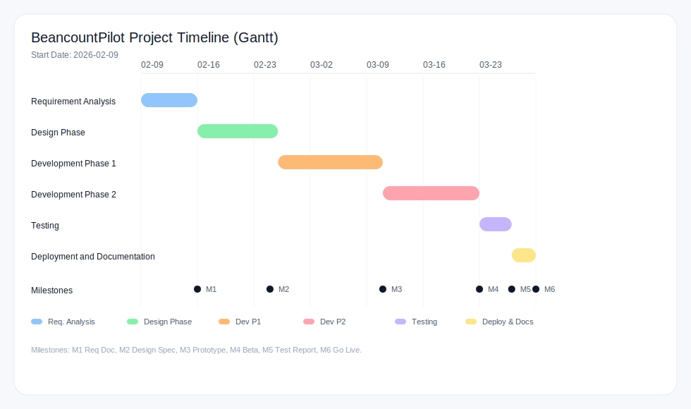

# Project Timeline Template (Gantt)

This template defines a project timeline using a Gantt chart format and a milestone checklist to track progress.

## How to Use

- Set the project start date and adjust week numbers as needed.
- Fill in task start/end dates and update progress percentages.
- Mark milestones as done when completed.

## Project Start Date

- Start Date: YYYY-MM-DD
- Target End Date: YYYY-MM-DD

## 设置起始时间（SVG 图）

1. 打开 `docs/project_timeline_gantt.svg`。
2. 修改顶部文字 `Start Date: YYYY-MM-DD` 为你的起始日期。
3. 若起始周有变化，按需修改时间轴上的 `W1`~`W9` 标签。
4. 需要对齐日期时，调整每个阶段条形的 `x`（起始位置）与 `width`（持续时长）。

## Gantt Chart

| ID  | Phase    | Task                             | Owner | Start | End | Duration (Days) | Progress | Dependencies | Notes |
| --- | -------- | -------------------------------- | ----- | ----- | --- | --------------- | -------- | ------------ | ----- |
| 1.1 | Planning | Kickoff & scope alignment        |       |       |     |                 | 0%       |              |       |
| 1.2 | Planning | Requirements & success criteria  |       |       |     |                 | 0%       | 1.1          |       |
| 1.3 | Planning | Project plan & timeline approval |       |       |     |                 | 0%       | 1.2          |       |
| 2.1 | Design   | Architecture & data model        |       |       |     |                 | 0%       | 1.3          |       |
| 2.2 | Design   | API design & contracts           |       |       |     |                 | 0%       | 2.1          |       |
| 2.3 | Design   | UI/UX flows (if applicable)      |       |       |     |                 | 0%       | 2.1          |       |
| 3.1 | Build    | Core backend implementation      |       |       |     |                 | 0%       | 2.2          |       |
| 3.2 | Build    | Frontend implementation          |       |       |     |                 | 0%       | 2.3          |       |
| 3.3 | Build    | Integration & configuration      |       |       |     |                 | 0%       | 3.1, 3.2     |       |
| 4.1 | QA       | Test plan & test cases           |       |       |     |                 | 0%       | 3.3          |       |
| 4.2 | QA       | Functional testing               |       |       |     |                 | 0%       | 4.1          |       |
| 4.3 | QA       | Performance & security checks    |       |       |     |                 | 0%       | 4.2          |       |
| 5.1 | Release  | UAT & stakeholder sign-off       |       |       |     |                 | 0%       | 4.3          |       |
| 5.2 | Release  | Deployment & monitoring setup    |       |       |     |                 | 0%       | 5.1          |       |
| 5.3 | Release  | Post-release review              |       |       |     |                 | 0%       | 5.2          |       |

## Milestones

| Milestone ID | Milestone                    | Target Date | Status      | Notes |
| ------------ | ---------------------------- | ----------- | ----------- | ----- |
| M1           | Project kickoff complete     |             | Not Started |       |
| M2           | Requirements finalized       |             | Not Started |       |
| M3           | Architecture approved        |             | Not Started |       |
| M4           | API contracts approved       |             | Not Started |       |
| M5           | MVP feature complete         |             | Not Started |       |
| M6           | Test completion              |             | Not Started |       |
| M7           | UAT sign-off                 |             | Not Started |       |
| M8           | Production release           |             | Not Started |       |
| M9           | Post-release review complete |             | Not Started |       |

## Weekly Tracking

| Week   | Planned Work | Actual Progress | Risks/Blockers | Next Steps |
| ------ | ------------ | --------------- | -------------- | ---------- |
| Week 1 |              |                 |                |            |
| Week 2 |              |                 |                |            |
| Week 3 |              |                 |                |            |
| Week 4 |              |                 |                |            |
| Week 5 |              |                 |                |            |
| Week 6 |              |                 |                |            |

## Change Log

| Date       | Change                   | Owner | Notes |
| ---------- | ------------------------ | ----- | ----- |
| YYYY-MM-DD | Initial timeline created |       |       |
